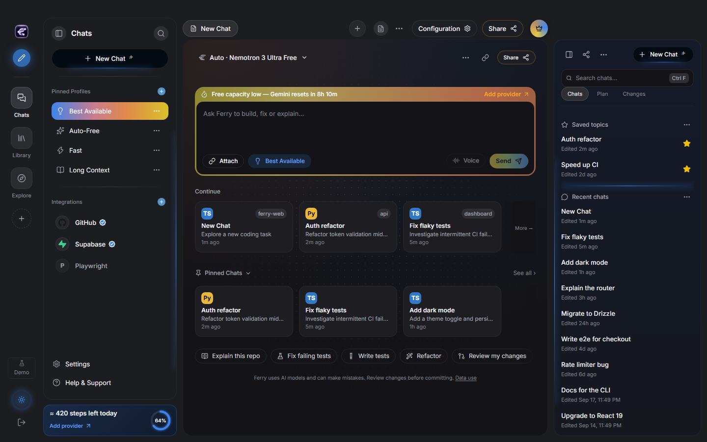
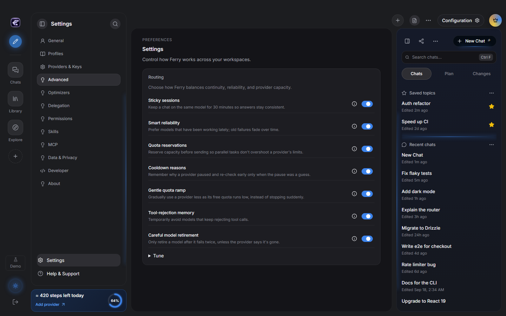

# Ferry

Ferry is a Windows-first desktop and CLI coding agent that can route requests across provider APIs and locally installed coding agents. The desktop combines sessions, model/provider status, routing and usage controls. The engine-backed workflows are evolving; provider availability and free allowances are controlled by providers and can change without notice.





## Install

Download the **Ferry-Setup** installer or **portable** build from [Ferry Releases](https://github.com/sico-vibes/ferry/releases). The installer is per-user and can add the bundled `ferry` CLI to your PATH. Windows may show a SmartScreen warning because beta installers are unsigned. Select **More info → Run anyway** only when the file came from the official Ferry Releases page. The portable build runs without installing Ferry.

Every code merge to `main` publishes a public `0.9.0-beta.N` pre-release. Installed beta builds check for updates at startup and every six hours; automatic downloads are enabled by default and can be changed in Settings > About.

## First run

Open **Providers & Keys**, choose a provider, and add your own API key. Ferry stores provider secrets in the operating system keyring; they are not kept in the project files. Some providers need an account, billing setup, phone verification, or an active trial. You are responsible for their terms and charges. Choose a routing profile and start a session.

Free capacity is modest and volatile. Daily requests (RPD) and per-model limits usually determine practical use before a large token-per-day headline does. Limits may be shared, model-specific, regional, or reduced at any time. Free endpoints can have different data-use terms from paid plans; check each provider’s current policy before sending sensitive content. Ferry does not promise a fixed number of free coding sessions.

## CLI quickstart

```sh
ferry --help
ferry doctor --providers
ferry run "Explain this project" --engine local
```

See [CLI commands and flags](docs/CLI.md), [routing](docs/ROUTING.md), and [troubleshooting](docs/TROUBLESHOOTING.md). The default CLI engine may be a mock in development; use `--engine local` for the local engine where available.

## Privacy

Ferry is a bring-your-own-key application. Provider requests go to the provider you select and are subject to that provider’s logging, retention, and training policies. Local session/workspace data is stored on your computer. Ferry does not pool provider accounts or claim that a provider’s free tier is private. Subscription OAuth integrations are unofficial and carry account suspension risk; see [Providers](docs/PROVIDERS.md).

## License

Ferry is distributed under the license in [LICENSE](LICENSE). Third-party notices and licenses are listed in [NOTICE](NOTICE).
